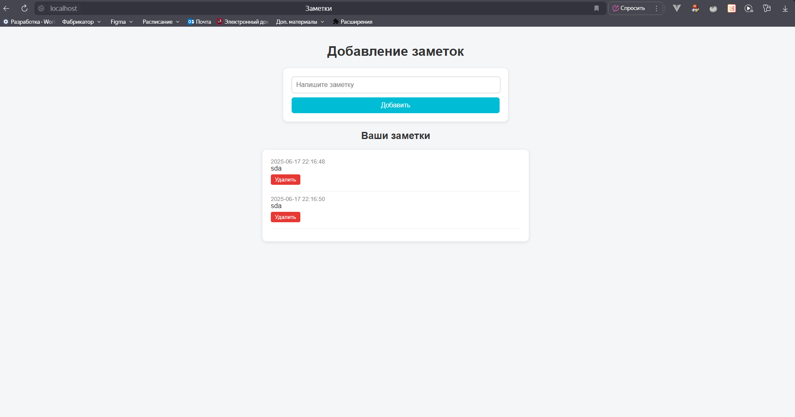
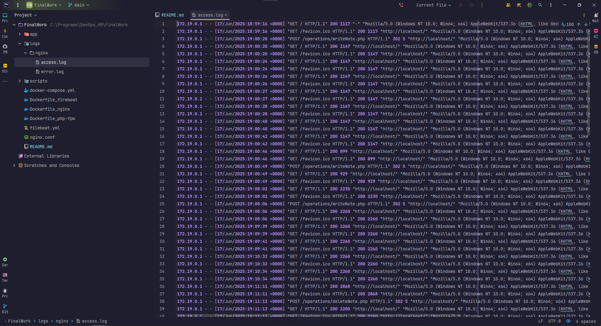
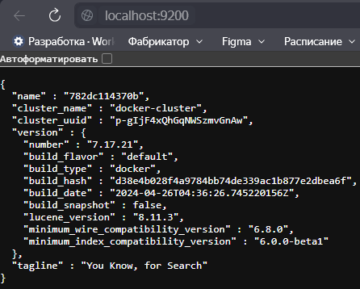
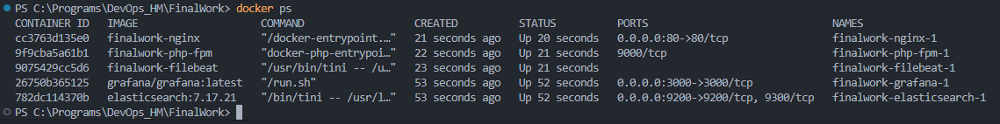

# Приложение для заметок
Простое веб-приложение для создания заметок с использованием **PHP-FPM**, **Nginx** и системой логирования через **Elasticsearch + Grafana**.

---

## 📁 Структура проекта

<pre>
.
├── app/                      # PHP-приложение
│   ├── index.php             # Главная страница (UI для заметок)
│   ├── operations/           # Операции над заметками
│   │   ├── getNotes.php      # Получение заметок
│   │   └── writeNote.php     # Добавление новой заметки
│   └── notes.txt             # Хранилище заметок (файл)
│
├── logs/nginx/              # Логи Nginx
│   ├── access.log
│   └── error.log
│
├── scripts/                 # Скрипты управления
│   ├── build.sh             # Сборка Docker-образов
│   └── deploy.sh            # Запуск контейнеров
│
├── nginx.conf               # Конфигурация Nginx
├── filebeat.yml             # Настройка Filebeat для логов
│
├── Dockerfile_php-fpm       # Dockerfile для PHP-FPM
├── Dockerfile_nginx         # Dockerfile для Nginx
├── Dockerfile_filebeat      # Dockerfile для Filebeat
│
└── docker-compose.yml       # Docker Compose файл
</pre>


---

## 🚀 Запуск проекта

```bash
./scripts/build.sh -t v1    # Сборка Docker-образов
./scripts/deploy.sh -t v1   # Запуск контейнеров
```

### Приложение


### Логи

.png)


### Контейнеры

