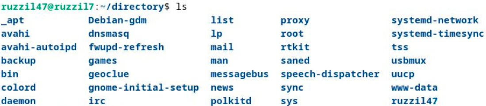

1. Функция `log()`

    Используется для:

    - вывода сообщений в стандартный поток вывода (stdout),

    - а также для записи этих сообщений в лог-файл.

2. Функция `create_user_directory()`

    Отвечает за:

    - создание пользовательской директории,

    - установку необходимых прав доступа на эту директорию.

3. Обработка аргументов командной строки

    - Проверяется наличие аргумента `-d`, который указывает корневую директорию.

    - Далее выполняется проверка: существует ли указанная директория.

4. Обход пользователей системы

    - С помощью цикла происходит перебор всех пользователей системы.

    - Для каждого пользователя может выполняться создание директории и логирование.

