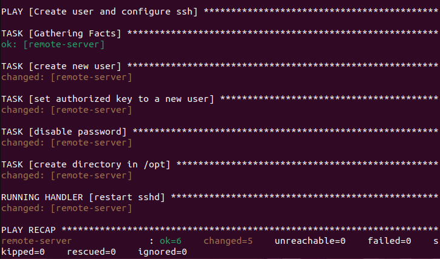
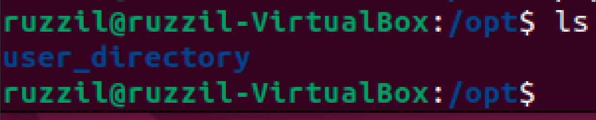
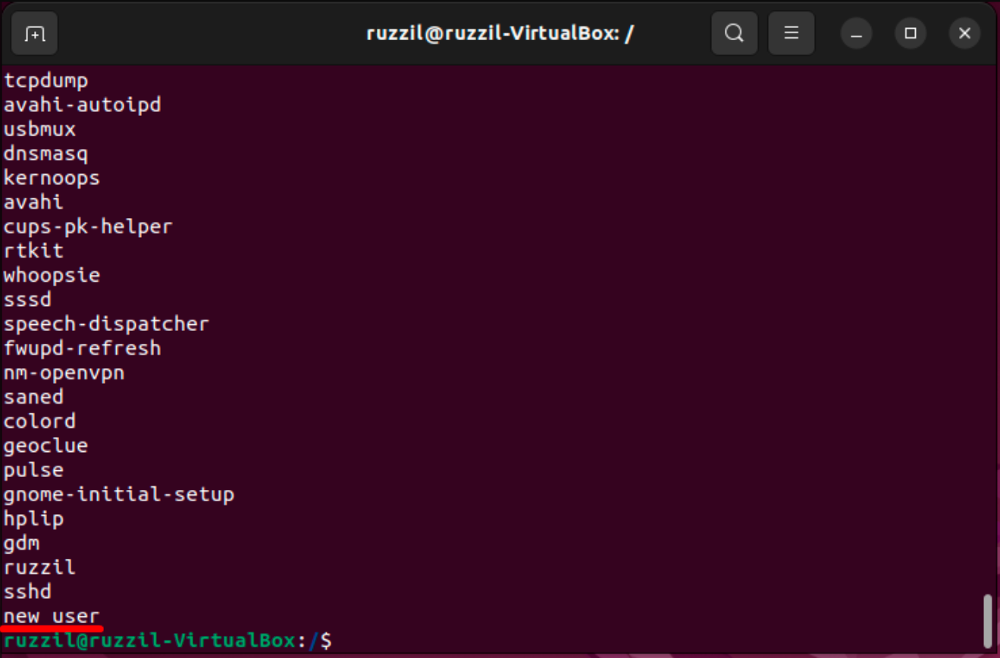

# ansible.cfg
host_key_checking = False
- Выключаем проверку ключей при подключении по протоколу SSH
# hosts.ini
1) remote-server: Имя хоста, к которому будем подключаться
2) ansible_host=192.168.118.149: IP-адрес, по которому будем подключаться к удаленному серверу
3) ansible_user=ruzzil: Имя пользователя на удаленном сервере
4) ansible_ssh_public_key_file=/home/vboxuser/.ssh/id_rsa.pub: Это путь к файлу публичного ключа SSH
# create_user_ssh.yaml
1) Создание нового пользователя:
Создает нового пользователя с именем new_user и оболочкой /bin/bash, а также создает домашний каталог для этого пользователя.
2) Установка авторизованного ключа для нового пользователя:
Добавляет публичный SSH-ключ (расположенный в файле ~/.ssh/id_rsa.pub) в список авторизованных ключей для пользователя new_user.
3) Отключение авторизации по паролю SSH:
Отключает авторизацию по паролю SSH путем добавления или изменения строки PasswordAuthentication no в файле конфигурации SSH (/etc/ssh/sshd_config).
4) Создание каталога в /opt:
Создает каталог /opt/user_directory с правами доступа 660
# Запуск
ansible-playbook playbooks/create_user_ssh.yaml

